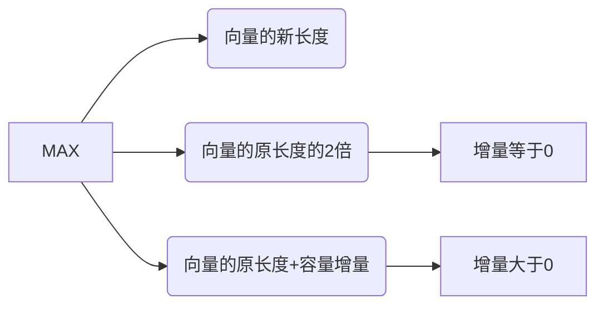

## 基本概念和数据类型
### 基本概念

-  **标识符（identifier）**
 1. 用来表示的有效字符序列：类、变量、方法、数组、文件
 2. 命名规则：
 	1.  以字母、下划线或货币符号开始,后跟上述三种符号和数字(0-9)，字母不限于英文字母，货币符号除$,也可以是其他符号如￥。
	2. 不能使用其他特殊符号，如: +、@、&、空格等。
	3. 不能与Java关键字同名
	4. 英文字母大小写敏感
	5. 长度无最大长度的限制  （建议 小于255个字符）

- **关键字**
1. Java语言本身必须使用的标识符
2. 保留字是Java语言保留起来不允许用户使用的标识符
3. 关键字（保留字）均用小写字母表示
### 数据类型
- **简单数据类型**
1. 整数类型 (Integer)：  byte， short， int (默认) ，long　
2. 浮点类型 (Floating)：float，double (默认)
3. 字符类型 (Textual)： char　
4. 布尔类型 (Logical)： boolean
- **引用（复合）数据类型**
interface  数组  class  Vector  Date  HashMap … …
String           Unicode字符集16位   0~65535

## 简单数据类型优先级和转换
- **简单类型数据的优先级**
byte,short,char  <  int   <  long  < float  < double   (由低到高）

- **自动类型转换**
当两个简单数据类型的数据进行二元运算，要先将两个操作数转换成同一类型的数据，再进行运算。
自动类型转换规则：

| 操作数1类型 | 操作数2类型 | 类型转换 |
|:--------:| :-----------:|:----------:|
| byte、short、char |   int　 |  int |
|byte、short、char、int|   long|　long|
|byte、short、char、int、long|　float|float|
|byte、short、char、int、long、float| double| double|

- **强制类型转换**
高优先级数据要转换成低优先级数据，需用强制类型转换。
强制类型转换一般存在数据精度损失。
强制类型转换格式：
目标类型	目标变量名=（目标类型）原变量名

## 运算符
- **算术运算符**

| 运算符 | 含义      |
|:--------:| :-------------:|
| + |加 |
-|减
*|乘
/|除
%|取余（取模）
++|自增
--|自减

- **位运算符**

| 运算符 | 含义|
|:---------:|:--------:|
|&|与
|`|`|或
|^|异或
|<<|左移
|>>|算术右移
|>>>|逻辑右移

注：对于>>,<<,>>>详解请参见[《彻底搞懂Java中的＞＞,＜＜,＞＞＞》](https://blog.csdn.net/h2763246823/article/details/113813970)


- **赋值运算符**

| 运算符 | 含义|
|:--------:|:---------:|
|=|赋值
|+=|加赋值
|-=|减赋值
|*=|乘赋值
|/=|除赋值
|%=|取余（取模）赋值

注：以+=为例，a+=1等价于a=a+1。

- **关系运算符**

|运算符|含义|
|:-------:|:--------:|
|<|小于
|<=|小于等于
|>|大于
|>=|大于等于
|==|等于
|!=|不等于

- **逻辑运算符**

|运算符|含义|
|:-------:|:--------:|
|&&|逻辑与
|`||`|逻辑或
|!|逻辑非

- **条件运算符**
? : 运算符
格式：条件表达式 ？表达式1：表达式2
含义：如果<条件表达式>为真，则执行<表达式1>，否则，<执行表达式2>

## input/output statement
- **input statement**
标准的输入设备是键盘库 java.util.Scanner (after JDK1.5)

```java
//导入库
import java.util.*;
//import java.util.Scanner也行

//创建对象
Scanner Input=new Scanner(System.in);

//调用方法
Input.nextInt()      //read int data
Input.nextByte()	 //read byte data
```

## 流程控制语句
- **分支语句**
1. **if**语句

```java
if(boolean-expression)
	statement;
```

功能：当boolean-expression为“真”时，执行statement 。
2. **if    else**语句
格式：

```java
if(boolean-expression)
	 statement1；
else statement2；
```


功能：当 boolean-expression为“真”时，执行statement1； 否则，执行statement 2。
3. **switch**语句

```java
switch(expression){
      case value1：statement1;
           break;
      case value2：statement2;
           break;
         ┆         ┆
      case valueN：statementN;
           break;
      default : defaultStatement;
}
```
功能：将expression的值与value1~valueN匹配，如果匹配则执行对应的statement，然后退出；否则                   执行defaultStatement。

- **循环语句**
1. **for**语句

```java
for(initialization; termination; iteration){　　　　
	//body
}
```
功能：首先对循环条件（通常为i）进行initialization（初始化），然后执行termination（判断是否终止循环），然后执行循环体里的语句，最后执行iteration（循环条件i改变）

2. **while**语句

```java
initialization
while(termination){　　　
	//body;　      　
iteration;
}
```
功能：首先对循环条件（通常为i）进行initialization（初始化），然后执行termination（判断是否终止循环），然后执行循环体里的语句，最后执行iteration（循环条件i改变）

3. **do while**语句

```java
initialization
do{　　　
	//body;　      　
iteration;
}while(termination);
```
功能：首先对循环条件（通常为i）进行initialization（初始化），然后执行循环体里的语句，然后执行termination（判断是否终止循环），最后执行iteration（循环条件i改变）

注：**while**和**do while**语句的区别在于执行循环体和执行termination的顺序。

- **跳转语句**
1. **break**语句
格式：break；
功能：终止当前循环体，转移到循环语句的下一条语句或标号处执行。

2. **continue**语句
 格式：continue；
 功能： 跳过当前循环体的剩余语句，转移到下一次循环或标号处执行。

3. **return**语句
 格式：return    [返回值]；
功能：终止方法或程序的执行，将控制返回调用者。

## 数组和向量
### 数组
1. **一维数组的声明**
	```java
	arrayType  arrayName[];

	arrayType []arrayName;
	```
2. **一维数组的创建**

	```java
	//数组元素为简单数据类型

 	//静态初始化
  	arrayType  arrayName[]={element1[,element2…]};
 	arrayType  []arrayName={element1[,element2…]};
 	//例如
 	int [] samllPrimes={2,3,5,7,11,13};

	//动态初始化
	arrayName= new arrayType[arrayLength];
	//声明与初始化合并
	arrayType arrayName= new arrayType[arrayLength];
	//例如
	int arr[]=new int[10]

	//数组元素为复合数据类型

	//创建数组元素
	arrayName= new arrayType[arrayLength];
	//为数组元素开辟存储空间
	arrayName[i]= new arrayType[paramList]
	//例如
	String  stringArray[];
    stringArray=new String[3];
    stringArray[0]=new String(″Welcome″);
    stringArray[1]=new String(″To″);
    stringArray[2]=new String(″Zhnejiang″);
	```
3. **数组操作**
	引用数组元素，下标从0开始
	数组复制
      使用系统类的方法 ( System.arraycopy )。
   	```java
   	/*
   	*sourceArray             		被复制的数组的数组名
   	*sourcePosition      			被复制的数组的起始位置
   	*destinationArray  				新数组的数组名
   	*destinationposition 			新数组储存复制的数组的起始位置
   	*numberOfEntriesToCopy 			需要被复制的元素个数
   	*/
   	//导入所需的库
   	import java.io.*;

	System.arraycopy( sourceArray, sourcePosition,
	destinationArray, destinationposition, numberOfEntriesToCopy)
	```

### 向量
- 是 java.util 包中的一个类，实现了类似动态数组的功能。
- 向量与数组的重要区别之一就是 向量的容量是可变的
1. 向量的容量：向量的存储空间大小
2. 向量的长度：线路的实际元素个数
3. 向量的增量：向量的长度发生变化时，向量容量的增加量
4. 增大容量时，向量的新容量取值：



- 声明格式

```java
Vector <datatype> variable_identifier;
```

- 构造方法

```java
public Vector()
//创建空向量, 初始容量为 10 ,容量增量为 0 。
public Vector(int initialCapacity)
//创建空向量, 初始容量为capacity, 容量增量为 0 。
public Vector(int initialCapacity, int capacityIncrement)
//创建空向量, 初始容量为 initialCapacity，容量增量为 capacityIncrement。
```
- 添加元素

```java
public boolean add(Element obj)
//把element组件加到向量末尾，同时大小加1，向量容量比以前大1
public void addElement(Element obj)
//同上
public void add(int index,E element)
//把element组件加到指定处，此后的内容向后移动1 个单位。 注意与 insertElementAt 的不同参数。
public void insertElementAt(E element,int index)
//把element组件加到指定处，此后的内容向后移动1个单位
```
- 修改元素

```java
public void set(int index, E element)
//用指定元素替换此向量中指定位置的元素。
public void setElementAt(E element,int index)
//将此向量的指定索引处的组件设置为指定对象。
```
- 删除元素

```java
public void    clear()
//Removes all of the elements from this Vector.
public void   removeAllElement()
//Removes all components from this vector and sets its size to zero.
public void remove(int index )
//Removes the element at the specified position in this Vector.    Shifts any subsequent elements to the left (subtracts one from their indices). Returns the element that was removed from the Vector.
public void removeElementAt(int index)
//Deletes the component at the specified index.
public boolean remove(object obj)
//Removes the first occurrence of the specified element in this Vector If the Vector does not contain the element, it is unchanged. More formally, removes the element with the lowest index i such that (o==null ? get(i)==null : o.equals(get(i))) (if such an element exists).
public boolean removeElement(object obj)
//Removes the first (lowest-indexed) occurrence of the argument from this vector. If the object is found in this vector, each component in the vector with an index greater or equal to the object's index is shifted downward to have an index one smaller than the value it had previously.
```
- 查询

```java
public boolean contains(object obj)
//Returns true if this vector contains the specified element.
public boolean equals(object obj)
//Compares the specified Object with this Vector for equality.
public int indexof(object obj)
//Returns the index of the first occurrence of the specified element in this vector, or -1 if this vector does not contain the element.
public int indexof(object obj,int index)
//Returns the index of the first occurrence of the specified element in this vector, searching forwards from index, or returns -1 if the element is not found.
public int lastIndexof(object obj)
//Returns the index of the last occurrence of the specified element in this vector, or -1 if this vector does not contain the element.
public int lastIndexof(object obj,int index)
//Returns the index of the last occurrence of the specified element in this vector, searching backwards from index, or returns -1 if the element is not found.
public int capacity()
//Returns the current capacity of this vector.
public int size()
//Returns the number of components in this vector.
public boolean isEmpty()
//Tests if this vector has no components.
public void setSize(int newSize)
//Sets the size of this vector.
```
- 可在向量的任意位置插入不同类型的对象，无需考虑对象的类型，也无需考虑向量的容量。
- 向量只能存储对象，不能直接存储简单数据类型。
- 适合向量的场合:
频繁进行对象的插入和删除工作
需要处理的对象数目不定
列表成员全部都是对象，或者可以方便的用对象表示
需要很快确定列表内是否存在某一特定对象，并且需要很快了解到对象的存放位置
- 适合数组的场合:
所需处理的对象数目大致可以确定
所需处理的是简单数据类型
