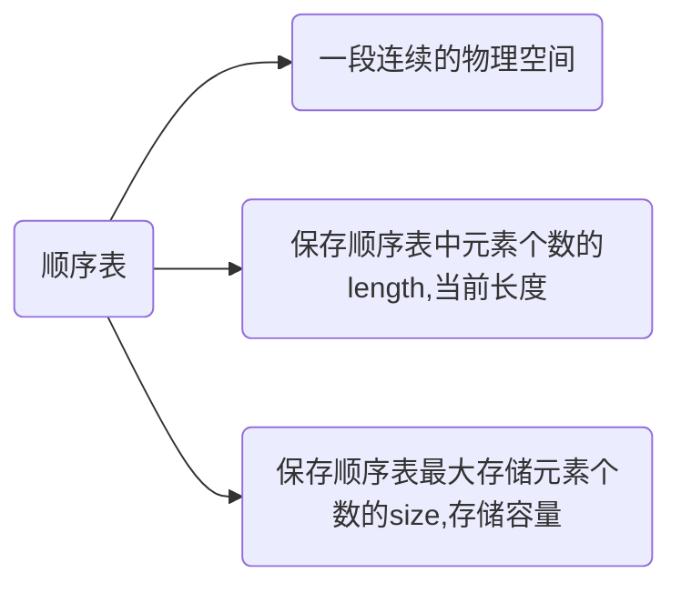

## 顺序表
顺序表，全名顺序存储结构，是[线性表](https://blog.csdn.net/h2763246823/article/details/108021474)中的一种。

顺序表遵循线性表的存储逻辑关系为“一对一”的数据的特点。同时，顺序表对数据的物理存储结构也有特殊的要求：存储数据前需要申请一块足够大的物理空间，数据依次存入空间中，不留间隙。

例如，使用顺序表存储集合{1，2，3，4，5}，数据的最终存储状态如下图：


理解顺序表的存储结构时，可以参考数组的存储结构。
## 顺序表的建立
### 理论
#### 定义数据表
首先，我们需要明确顺序表的建立所需的组成部分。

**注**：

1. 囊括length 和 size 是为了方便后期使用表中的数据
2. 正常情况下，size要大于length

**步骤**：

1. 声明一个长度不确定的数组,也叫“动态数组”
2. 声明一个length保存顺序表的长度
3. 声明一个size保存顺序表分配的存储容量

#### 初始化顺序表
**步骤**：

1. 申请足够大小的物理空间
2. 分别给size和length赋初值

### 实践
明确理论之后，我们就开始建立一个顺序表。
注：此处我采用C++模板编写

#### 定义顺序表
```cpp
template<typename T>
class Table {
private:
	T* head;	//声明一个长度不确定的数组,也叫“动态数组”
	int length;	//声明一个length保存顺序表的长度
	int size;	//声明一个size保存顺序表分配的存储容量
//顺序表的一些常规操作声明，目前可以不关注
//只是大致的功能，自己创建时可以自行修改。
public:
	Table(int size);	//顺序表的初始化
	void add(T value);	//尾部添加数据
	void insert(T value, int pos); //中间插入数据
	void del(T value);	//删除指定数据
	void change(T value, int pos);	//改变指定位置的数据
	void show();	//显示表中全部数据
	int query(T value);	//查询数据
	T operator[](int i); //[]操作符重载
};
```

#### 初始化顺序表

```cpp
template<typename T>
Table<T>::Table(int size) {
	head = new T[size];	//动态申请存储空间
	length = 0;			//空表的长度初始化为0
	this->size = size;	//空表的存储容量为size
}
```

### 顺序表的使用

#### 添加数据

**步骤**：

1. 判断是否需要扩容，需要则扩容，size+1
2. 将数据存入表中下标为length的位置，length+1

```cpp
template<typename T>
void Table<T>::add(T values) {
	if (length == size) {
		T* temp = new T[size + 1];
		//注意对head中的数据进行保存
		for (int i = 0; i < length; i++) {
			temp[i] = head[i];
		}
		delete[] head;
		head = temp;
		size++;
	}
	int i = length;
	head[i] = values;
	length++;
}
```
#### 插入数据

**步骤**：

1. 判断插入位置是否正确
2. 判断是否需要扩容，需要则扩容，size+1
3. 将要插入位置数据以及后续数据整体向后移动一个位置
4. 将元素放到腾出来的位置上，length+1

```cpp
template<typename T>
void Table<T>::insert(T values, int pos) {
	if (pos<1 || pos>length + 1) {
		cout << "元素插入位置有误" << endl;
		return;
	}
	if (length == size) {
		T* temp = new T[size + 1];
		for (int i = 0; i < length; i++) {
			temp[i] = head[i];
		}
		delete[] head;
		head = temp;
		size++;
	}
	for (int i = length - 1; i >= pos - 1; i--) {
		head[i + 1] = head[i];
	}
	head[pos - 1] = values;
	length++;
}
```
#### 删除数据

**步骤**：

1. 遍历找到目标数据的位置
2. 将后续数据整体向前移动一个位置，length-1

```cpp
template<typename T>
void Table<T>::del(T values) {
	for (int i = 0; i < length; i++) {
		if (head[i] == values) {
			for (int j = i+1; j < length; j++) {
				head[j - 1] = head[j];
			}
		}
	}
	length--;
}
```
#### 修改数据

**步骤**：

1. 遍历找到目标数据的位置
2. 直接修改数据的值

```cpp
template<typename T>
void Table<T>::change(T values, int pos) {
	head[pos - 1] = values;
}
```
#### 显示数据

**步骤**：遍历输出

```cpp
template<typename T>
void Table<T>::show() {
	for (int i = 0; i < length;i++) {
		cout << head[i] << " ";
	}
	cout << endl;
}
```

#### 查询数据
注： 可以使用多种算法实现查找，比如说二分查找算法，插值查找算法等。
这里使用 顺序查找算法
**步骤**：遍历匹配目标数据

```cpp
template<typename T>
int Table<T>::query(T values) {
	for (int i = 0; i < length; i++) {
		if (head[i] == values) {
			return i+1;
		}
	}
	return -1;
}
```
